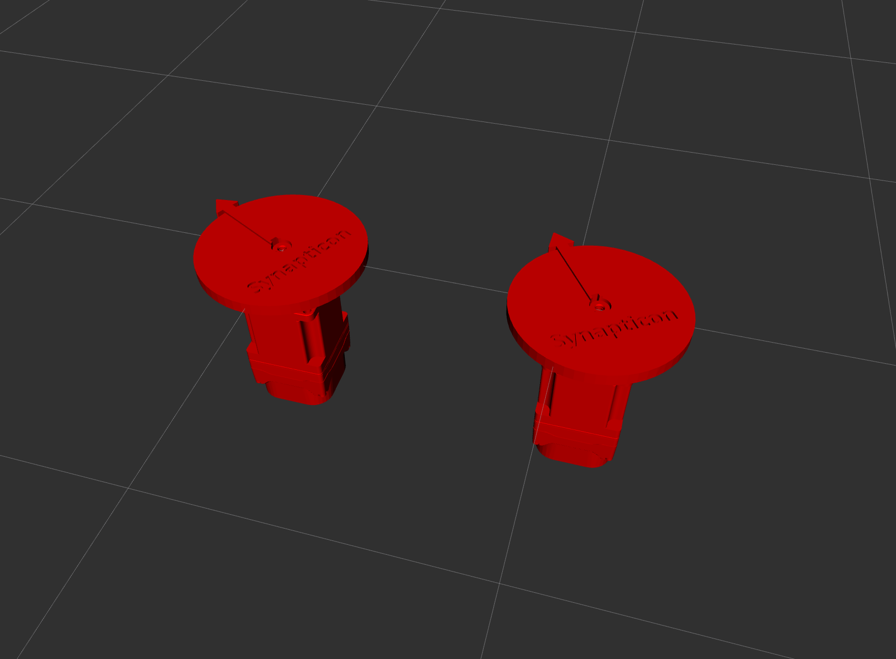
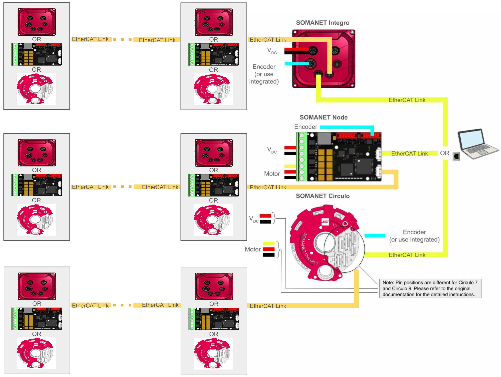

# Controlling Synapticon Devices Using the ROS2 Package

## Description

This repository provides an example of how to use Synapticon drives (SOMANET Node, SOMANET Circulo and SOMANET Integro) in CSP (Cyclic Sync Position), CSV (Cyclic Sync Velocity), and CST (Cyclic Sync Torque) modes using the ROS2 package. It utilizes `SOEM Ethercat Master`. The ROS 2 package was originally developed by Andy Zelenak. Synapticon GmbH added examples, simulation, and extended instructions for easier installation, as well as support for containerization using Docker.



## Table of Contents

1. [Intention](#1-intention)
2. [Overview](#2-overview)
   - 2.1. [Hardware](#21-hardware)
   - 2.2. [Software](#22-software)
      - 2.2.1. [Ubuntu with ROS2](#221-ubuntu-with-ros2)
         - 2.2.1.1. [ROS2 Installation](#2211-ros2-installation)
         - 2.2.1.2. [Synapticon Package Installation](#2212-synapticon-package-installation)
         - 2.2.1.3. [Demo](#2213-demo)
         - 2.2.1.4. [Running Without Sudo (Optional)](#2214-running-without-sudo-optional)
      - 2.2.2. [Isolated Environment (Docker)](#222-isolated-environment-docker)
         - 2.2.2.1. [Docker Installation](#2221-docker-installation)
         - 2.2.2.2. [Synapticon Package Installation](#2222-synapticon-package-installation)
         - 2.2.2.3. [Demo](#2223-demo)
3. [Disclaimer](#3-disclaimer)


## 1. Intention

The intention of this document is to provide instructions on how to quickly begin Synapticon Devices with the ROS2 package using the Synapticon library. Additionally, in order to make it compatible with other Linux distributions, corresponding Docker images are provided.


## 2. Overview

The following subsections briefly demonstrate hardware and software required for using Synapticon devices with this package.

### 2.1. Hardware

In the figure below, a block diagram of the wiring used in this setup is provided. Drives can be used once the parameters are configured with [OBLAC tools](https://www.synapticon.com/en/products/oblac-drives). Detailed instructions and wiring diagrams for all the devices are available on the [Synapticon Web site](https://www.synapticon.com/en/support/dokumentation) documentation. The package allows daisy chaining of all the Synapticon drives in any order as indicated in the image below.





### 2.2. Software

In this demo, two scenarios are considered:
- Ubuntu 22.04 or 24.04 is installed on the system and ROS2 (humble, rolling or jazzy) together with the Synapticon package will be installed on that system
- The user wants to run the package in an isolated environment (Docker)


#### 2.2.1. Ubuntu with ROS2

To install ROS2 on your Ubuntu machine, follow the steps from [ros.org](https://docs.ros.org/en/humble/Installation/Ubuntu-Install-Debs.html) and install the full version. The minimal version can also be installed; however, if simulation is desired, RViZ must additionally be installed.  After the installation, some configuration steps as described [here](https://docs.ros.org/en/humble/Tutorials/Beginner-CLI-Tools/Configuring-ROS2-Environment.html) are required. For the completeness of the demo, the commands in the following subsection are copied from the above website and should be executed for the ROS2 installation.

##### 2.2.1.1. ROS2 Installation

To ensure that locale supports UTF-8, run the following commands:
```bash
sudo apt update && sudo apt install locales
sudo locale-gen en_US en_US.UTF-8
sudo update-locale LC_ALL=en_US.UTF-8 LANG=en_US.UTF-8
export LANG=en_US.UTF-8
```
Enable Ubuntu Universe repository:
```bash
sudo apt install software-properties-common
sudo add-apt-repository universe
```
Add GPG key:
```bash
sudo apt update && sudo apt install curl -y
sudo curl -sSL https://raw.githubusercontent.com/ros/rosdistro/master/ros.key -o /usr/share/keyrings/ros-archive-keyring.gpg
```
Add repository to the sources:
```bash
echo "deb [arch=$(dpkg --print-architecture) signed-by=/usr/share/keyrings/ros-archive-keyring.gpg] http://packages.ros.org/ros2/ubuntu $(. /etc/os-release && echo $UBUNTU_CODENAME) main" | sudo tee /etc/apt/sources.list.d/ros2.list > /dev/null
```
Update apt cache:
```bash
sudo apt update
```
This command updates the packages on your system. Note that if the commands after this work, skip this step.
```bash
sudo apt upgrade
```
Finally, install ROS and compilers (replace `ROS_DISTRO` with the desired ROS distribution - humble, jazzy or rolling):
```bash
sudo apt install ros-ROS_DISTRO-desktop
sudo apt install ros-dev-tools
```
After the installation is complete, add the following line to the end of `/home/USER/.bashrc` file (replace `ROS_DISTRO` with the desired ROS distribution - humble, jazzy or rolling):
```bash
source /opt/ros/ROS_DISTRO/setup.bash
```
In order for ROS2 to not interfere with the communication on other ports, we set the Domain ID (detailed information is available [here](https://docs.ros.org/en/humble/Concepts/Intermediate/About-Domain-ID.html)).  For this demo, we just used ROS_DOMAIN_ID=1. To do so, add the following at the end of `/home/$USER/.bashrc`:
```bash
export ROS_DOMAIN_ID=1
```
After this, close and reopen all your terminals.
To verify the installation, open two terminals and run:
```bash
ros2 run demo_nodes_cpp talker
ros2 run demo_nodes_py listener
```
If the nodes are communicating, the installation was successful.

##### 2.2.1.2. Synapticon Package Installation

**OPTION 1:** Installing from Source

Create an ROS2 workspace:
```bash
mkdir -p ~/ros2_ws/src
cd ~/ros2_ws/src
```
Clone the Synapticon package:
```bash
git clone https://github.com/synapticon/synapticon_ros2_control
```
Install build tools:
```bash
sudo apt install python3-colcon-common-extensions
```
Build the package:
```bash
cd ~/ros2_ws
rosdep install --from-paths src -y --ignore-src
colcon build
```
Additionally, you can source the workspace by adding the following line to the `/home/USER/.bashrc` file above the line where the ROS installation was sourced (above this line: `source /opt/ros/ROS_DISTRO/setup.bash`:
```bash
source /home/USER/ros2_ws/install/setup.bash
```

**OPTION 2:** Binary Installation

If required, add the ROS repository (this occurs only once):

```bash
sudo apt install software-properties-common
sudo add-apt-repository universe
sudo apt update
```
Install the Synapticon package (replace ROS_DISTRO with the ROS distribution you want - humble, jazzy or rolling):

```bash
sudo apt install ros-ROS_DISTRO-synapticon-ros2-control
```

Make sure rosdep is initialized and updated:

```bash
sudo rosdep init
rosdep update
```

Install its dependencies:

```bash
rosdep install synapticon_ros2_control
```
The package will get installed to `/opt/ros/ROS_DISTRO/share/synapticon_ros2_control/`.

**VERIFICATION**

The ethernet device name, to which the drive is connected, is required. This could be checked with the `ifconfig` command. Ethernet adapters usually start with `en`. To check if the master could be run and if the slaves are found, execute the following  in the terminal (replace `YOUR_ETHERNET_INTERFACE` with the one found with `ifconfig`).
If you installed from source:
```bash
sudo /home/$USER/ros2_ws/install/synapticon_ros2_control/bin/torque_control_executable YOUR_ETHERNET_INTERFACE
```
or if you installed using the binary installation (replace `ROS_DISTRO` with the desired ROS distribution - humble, jazzy or rolling):
```bash
sudo /opt/ros/ROS_DISTRO/share/synapticon_ros2_control/bin/torque_control_executable YOUR_ETHERNET_INTERFACE
```
Before running other scripts, stop this one by CTRL+C (or wait - it will shutdown automatically after a while).

##### 2.2.1.3. Demo
For turning the motor in different modes, five terminals are required and in all of them execute:
```bash
sudo -i
source /home/YOUR_USER/.bashrc
```
- Terminal 1:

If you are running the demo with one motor:
```bash
ros2 launch synapticon_ros2_control elevated_permissions_1_dof.launch.py
```
If you are running the demo with two motors:
```bash
ros2 launch synapticon_ros2_control elevated_permissions_2_dof.launch.py
```
- Terminal 2:

If you are running the demo with one motor:
```bash
ros2 launch synapticon_ros2_control single_dof.launch.py eth_device:=YOUR_ETHERNET_DEVICE
```
If you are running the demo with two motors:
```bash
ros2 launch synapticon_ros2_control two_dof.launch.py eth_device:=YOUR_ETHERNET_DEVICE
```
- Terminal 3 - to show the running controllers
```bash
ros2 control list_controllers
```
(Information does not automatically refresh - it can be refreshed each M seconds
using `watch -n M ros2 control list_controllers`)
- Running motors with different controllers:

CSV (Cyclic Sync Velocity) mode:

Terminal 4 to turn on the controller :
```bash
ros2 service call /controller_manager/switch_controller controller_manager_msgs/srv/SwitchController "{activate_controllers: ['forward_velocity_controller'], deactivate_controllers: []}"
```
Terminal 5 to create a publisher:

If you are running the demo with one motor, send a command in rad/s. Gearing is not accounted for.
```bash
ros2 topic pub /forward_velocity_controller/commands std_msgs/msg/Float64MultiArray data:\ [1]
```
If you are running the demo with two motors:
```bash
ros2 topic pub /forward_velocity_controller/commands std_msgs/msg/Float64MultiArray data:\ [1,1]
```
Stopping it: CTRL+C on Terminal 5 and in Terminal 4:
```bash
ros2 service call /controller_manager/switch_controller controller_manager_msgs/srv/SwitchController "{activate_controllers: ['quick_stop_controller'], deactivate_controllers: ['forward_velocity_controller']}"
```
- CSP (Cyclic Sync Position) mode:

Terminal 4 to turn on the controller :
```bash
ros2 service call /controller_manager/switch_controller controller_manager_msgs/srv/SwitchController "{activate_controllers: ['forward_position_controller'], deactivate_controllers: [quick_stop_controller]}"
```
Terminal 5 to create a publisher:

If you are running the demo with one motor:
```bash
ros2 topic pub /forward_position_controller/commands std_msgs/msg/Float64MultiArray data:\ [140]
```
If you are running the demo with two motors:
```bash
ros2 topic pub /forward_position_controller/commands std_msgs/msg/Float64MultiArray data:\ [140, 140]
```
Stopping it: CTRL+C on Terminal 5 and in Terminal 4:
```bash
ros2 service call /controller_manager/switch_controller controller_manager_msgs/srv/SwitchController "{activate_controllers: ['quick_stop_controller'], deactivate_controllers: ['forward_position_controller']}"
```

- CST (Cyclic Sync Torque) mode:

Terminal 4 to turn on the controller :
```bash
ros2 service call /controller_manager/switch_controller controller_manager_msgs/srv/SwitchController "{activate_controllers: ['forward_torque_controller'], deactivate_controllers: [quick_stop_controller]}"
```
Terminal 5 to create a publisher (value is in per mille of torque):

If you are running the demo with one motor, send a command in per-mille of rated torque. Gearing is not accounted for.
```bash
ros2 topic pub /forward_torque_controller/commands std_msgs/msg/Float64MultiArray data:\ [10]
```
If you are running the demo with two motors:
```bash
ros2 topic pub /forward_torque_controller/commands std_msgs/msg/Float64MultiArray data:\ [10, 10]
```
Stopping it: CTRL+C on Terminal 5 and in Terminal 4:
```bash
ros2 service call /controller_manager/switch_controller controller_manager_msgs/srv/SwitchController "{activate_controllers: ['quick_stop_controller'], deactivate_controllers: ['forward_torque_controller']}"
```
##### 2.2.1.4. Running Without Sudo (Optional)

To run the example without using `sudo`, create:
```bash
sudo touch /etc/systemd/system/ros2_control_node.service
```
and use the text editor to paste the following into that file. Note that `YOUR_USER`, `ROS_DISTRO`, `pythonX.XX` and `elevated_permissions_X_dof.launch.py` must be replaced with the correct data.

```bash
[Unit]
Description=Launch ros2_control_node with socket permissions

[Service]
Type=simple
User=YOUR_USER
ExecStartPre=/bin/bash -c 'source /opt/ros/ROS_DISTRO/setup.bash; source /home/YOUR_USER/.bashrc; source /home/YOUR_USER/ros2_ws/install/setup.bash'
# Write the user environment to file, for debugging
#ExecStartPre=/bin/bash -c 'env > /home/YOUR_USER/Documents/ros_env_before_start.txt'

# This is essentially a copy of my normal user env
Environment="AMENT_PREFIX_PATH=/home/YOUR_USER/ros2_ws/install/synapticon_ros2_control:/opt/ros/ROS_DISTRO"
Environment="HOME=/home/YOUR_USER"
Environment="LD_LIBRARY_PATH=/opt/ros/ROS_DISTRO/opt/rviz_ogre_vendor/lib:/opt/ros/ROS_DISTRO/lib/x86_64-linux-gnu:/opt/ros/ROS_DISTRO/lib"
Environment="PATH=/opt/ros/ROS_DISTRO/bin:/usr/lib/ccache:/home/YOUR_USER/.local/bin:/usr/local/sbin:/usr/local/bin:/usr/sbin:/usr/bin:/sbin:/bin:/usr/games:/usr/local/games:/snap/bin:/snap/bin"
Environment="PYTHONPATH=/opt/ros/ROS_DISTRO/lib/pythonX.XX/site-packages:/opt/ros/ROS_DISTRO/local/lib/pythonX.XX/dist-packages"
Environment="ROS_DISTRO=ROS_DISTRO"
Environment="ROS_DOMAIN_ID=1"
Environment="ROS_PYTHON_VERSION=3"
Environment="ROS_VERSION=2"
Environment="ROSCONSOLE_FORMAT=[${severity}] - ${node}: [${time}] ${message}"
Environment="USER=YOUR_USER"
Environment="USERNAME=YOUR_USER"

ExecStart=/opt/ros/ROS_DISTRO/bin/ros2 launch synapticon_ros2_control elevated_permissions_X_dof.launch.py
AmbientCapabilities=CAP_NET_RAW

[Install]
WantedBy=multi-user.target
```
Save the file, restart the daemon:
```bash
sudo systemctl daemon-reload
```
and start the service:
```bash
sudo systemctl restart ros2_control_node.service
```
To check the service status and see the ROS console logging:
```bash
sudo systemctl status ros2_control_node.service
```
Now, the example can be run by these two commands:
```bash
sudo systemctl restart ros2_control_node.service
```
and, if running the demo with one motor:
```bash
ros2 launch synapticon_ros2_control single_dof.launch.py eth_device:=YOUR_ETHERNET_DEVICE
```
If you are running the demo with two motors:
```bash
ros2 launch synapticon_ros2_control two_dof.launch.py eth_device:=YOUR_ETHERNET_DEVICE
```
Changing the controllers and publishing the desired position/velocity/torque can be now executed without sudo.
To stop the `ros2_control_node`:
```bash
sudo systemctl stop ros2_control_node.service
```

#### 2.2.2. Isolated Environment (Docker)

For users with different Linux distributions or those preferring an isolated environment, Docker can be used. Installation steps can be found in the [Docker Documentation](https://docs.docker.com/engine/install/ubuntu/). Installation instructions are also provided below:

##### 2.2.2.1. Docker Installation

Install Docker and add the user to the Docker group:
```bash
sudo apt update
sudo apt install -y docker.io
sudo groupadd docker
sudo usermod -aG docker $USER
```
##### 2.2.2.2. Synapticon Package Installation
With the following command, the Docker image can be pulled (replace `ROS_DISTRO` with the desired ROS_distribution - humble, jazzy or rolling):
```bash
docker pull ghcr.io/synapticon/synapticon_ros2_control:ROS_DISTRO
```
To allow Docker containers to output the screen on your system, which is required for RViZ, execute this on the host system:
```bash
xhost +
```
For the first execution of the program, we build container named `ros2_container` from the downloaded docker image (replace `ROS_DISTRO` with the desired ROS_distribution - humble, jazzy or rolling):
```bash
docker run -it -v /var/run/dbus/system_bus_socket:/var/run/dbus/system_bus_socket -v /tmp/.X11-unix:/tmp/.X11-unix --ipc=host -e DISPLAY=$DISPLAY  --network=host --env QT_X11_NO_MITSHM=1 --privileged --name ros2_container ghcr.io/synapticon/synapticon_ros2_control:ROS_DISTRO
```
Now, the container is running. For all other occurrences, start the container using:
```bash
docker start ros2_container
```
For opening a new terminal in the running container, use:
```bash
docker exec -it ros2_container bash
```
and, once it opens, source the ROS2 environment using
```bash
source /root/.bashrc
```
To check if the master could be run and if the slaves are found, in the container terminal execute:
```bash
./install/synapticon_ros2_control/bin/torque_control_executable
```
Before running other scripts, stop this one by CTRL+C (or wait, it will shutdown automatically after a while).

##### 2.2.2.3. Demo

Connect the Synapticon device configured with OBLAC Tools to your ethernet port as shown in Figure 1. For the demo, run five terminals in the container (`docker exec -it ros2_container bash` and `source /root/.bashrc`)

- Terminal 1
If you are running the demo with one motor:
```bash
ros2 launch synapticon_ros2_control elevated_permissions_1_dof.launch.py
```
If you are running the demo with two motors:
```bash
ros2 launch synapticon_ros2_control elevated_permissions_2_dof.launch.py
```
- Terminal 2 - this one will open RViZ. If it fails, xhost + was not executed on your host machine. By spinning the motor by hand, movement should be seen in RViZ.
If you are running the demo with one motor:
```bash
ros2 launch synapticon_ros2_control single_dof.launch.py eth_device:=YOUR_ETHERNET_DEVICE
```
If you are running the demo with two motors:
```bash
ros2 launch synapticon_ros2_control two_dof.launch.py eth_device:=YOUR_ETHERNET_DEVICE
```
- Terminal 3 - to show the running controllers:
```bash
ros2 control list_controllers
```
(Information does not automatically refresh - it can be refreshed each M seconds
using `watch -n M ros2 control list_controllers`)

- Running motors with different controllers:
CSV (Cyclic Sync Velocity) mode:

Terminal 4 to turn on the controller :
```bash
ros2 service call /controller_manager/switch_controller controller_manager_msgs/srv/SwitchController "{activate_controllers: ['forward_velocity_controller'], deactivate_controllers: []}"
```
Terminal 5 to create a publisher:
If you are running the demo with one motor, send a velocity command in rad/s. Gearing is not accounted for.
```bash
ros2 topic pub /forward_velocity_controller/commands std_msgs/msg/Float64MultiArray data:\ [1]
```
If you are running the demo with two motors:
```bash
ros2 topic pub /forward_velocity_controller/commands std_msgs/msg/Float64MultiArray data:\ [1,1]
```
Stopping it: CTRL+C on Terminal 5 and in Terminal 4:
```bash
ros2 service call /controller_manager/switch_controller controller_manager_msgs/srv/SwitchController "{activate_controllers: ['quick_stop_controller'], deactivate_controllers: ['forward_velocity_controller']}"
```
- CSP (Cyclic Sync Position) mode:

Terminal 4 to turn on the controller :
```bash
ros2 service call /controller_manager/switch_controller controller_manager_msgs/srv/SwitchController "{activate_controllers: ['forward_position_controller'], deactivate_controllers: [quick_stop_controller]}"
```
Terminal 5 to create a publisher:
If you are running the demo with one motor:
```bash
ros2 topic pub /forward_position_controller/commands std_msgs/msg/Float64MultiArray data:\ [140]
```
If you are running the demo with two motors:
```bash
ros2 topic pub /forward_position_controller/commands std_msgs/msg/Float64MultiArray data:\ [140, 140]
```
Stopping it: CTRL+C on Terminal 5 and in Terminal 4:
```bash
ros2 service call /controller_manager/switch_controller controller_manager_msgs/srv/SwitchController "{activate_controllers: ['quick_stop_controller'], deactivate_controllers: ['forward_position_controller']}"
```

- CST (Cyclic Sync Torque) mode:

Terminal 4 to turn on the controller:
```bash
ros2 service call /controller_manager/switch_controller controller_manager_msgs/srv/SwitchController "{activate_controllers: ['forward_torque_controller'], deactivate_controllers: [quick_stop_controller]}"
```
Terminal 5 to create a publisher:
If you are running the demo with one motor, send a command in per-mille of rated torque. Gearing is not accounted for.
```bash
ros2 topic pub /forward_torque_controller/commands std_msgs/msg/Float64MultiArray data:\ [10]
```
If you are running the demo with two motors:
```bash
ros2 topic pub /forward_torque_controller/commands std_msgs/msg/Float64MultiArray data:\ [10, 10]
```
Stopping it: CTRL+C on Terminal 5 and in Terminal 4:
```bash
ros2 service call /controller_manager/switch_controller controller_manager_msgs/srv/SwitchController "{activate_controllers: ['quick_stop_controller'], deactivate_controllers: ['forward_torque_controller']}"
```

## 3. Disclaimer

This repository is an example of how to use SOMANET drives with ROS2 (humble, jazzy and rolling). It does not guarantee compatibility with the latest ROS versions or SOMANET firmware. The included code is for demonstration purposes only. Synapticon GmbH refuses any responsibility for any problem or damage by using the example configuration and code!
